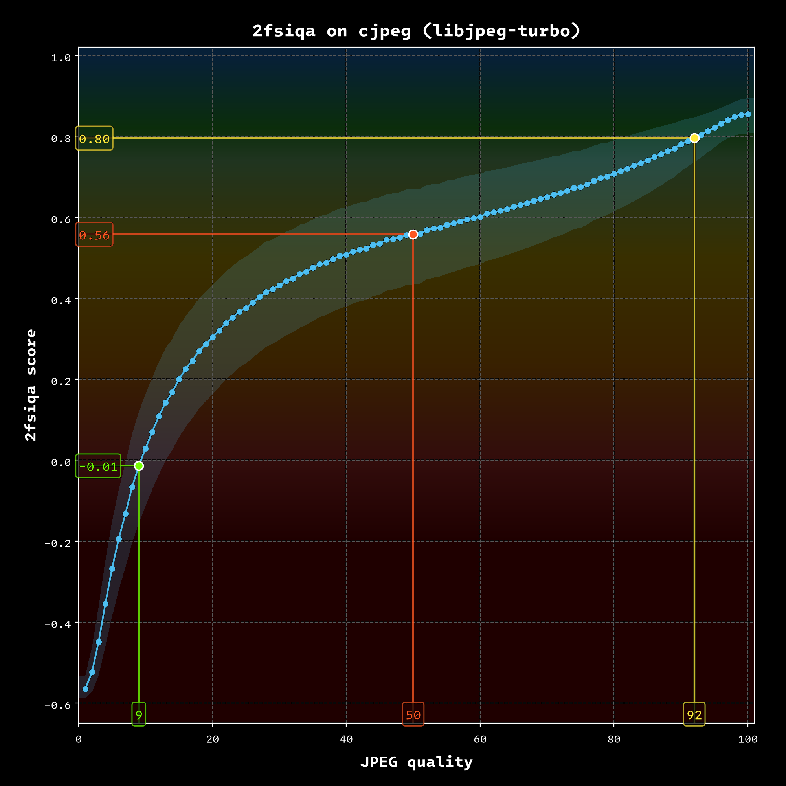

# 2fsiqa — Composite Image Quality Assessment Metric

 
A command-line tool that helps you put a number on the perceptual similarities between two images.

**2fsiqa** score range is <mark>~-0.6 – 1.0</mark>, where:

   <mark>**1.0**</mark>  — pair is identical  
   <mark>**Score > 0.0**</mark> — similar, with some differences (closer to 1.0 means more similar)  
   <mark>**Score < 0.0**</mark> — questionable that the images match

---

## Download

   <a href="https://github.com/DAPTYX/2fsiqa/releases">Releases page</a>

---

## Usage

    toofsiqa <reference> <distorted> [options]

or

    toofsiqa [options] <reference> <distorted>
 

Distorted image can be passed through a pipe, e.g.:

    magick <distorted> png:- | toofsiqa <reference>
 

Only pairs of still images with identical dimensions (width x height) are supported.

Supported image formats: avif, bmp, jpeg, png, pnm, tiff, webp

Inputs may be files or directories, a directory as an input enables batch mode.

Default run will return 2fsiqa score for a single pair, or average/minimum/maximum summary in batch mode
  

### Options:

    Print every metric together with 2fsiqa (default: composite 2fsiqa only):
    --showall

    Run only the named metric:
    --psnr --ssim --dssim --lacra --butter --vmaf

### Batch options:

    Print each pair score as it completes:
    --showpairs

    Write summary and per-pair stats to a text file
    Default path: inside the distorted directory, or next to the distorted file
    --savestats [path]

---

## What is it

### 2fsiqa

**2fsiqa** is a color-managed pipeline powered by [Little CMS](https://github.com/mm2/little-cms).  
It unifies the math of six well-known metrics under one umbrella.
Images are compared in a [color space](https://github.com/DAPTYX/2FSCP-26/blob/main/ABOUT.md#2fscp-26_allreal-allcolorsrgb)
that can hold every real color, with a different transfer gamma chosen for each metric.
That keeps the comparison consistent and makes fair evaluation of wide-gamut images possible.

Multi-metric approach makes it much harder for a distorted image to “cheat” a single method,
and it keeps the final score stable when one metric over-punishes some type of distortion.

Actual IQA work is done by:
- 2FS-psnr
- 2FS-ssim
- 2FS-dssim
- 2FS-ssimulacra2
- 2FS-butteraugli
- 2FS-vmaf

The 2FS- prefix marks these as 2fsiqa-specific versions — they should not be compared with the original metrics.
Treat them as their own separate scores if you ever want to use them individually.
 

### 2fsiqa score

To turn the six raw numbers into one 2fsiqa score, three levers are used:

- Linear mapping of each metric between a custom “peak” and “zero”
- A curvature applied to each mapped value
- Different weights for each metric

Peak and zero are empirical, established by distortions of a large, diverse image set.
The peak cuts off tiny fluctuations at the top that carry no useful information about visible damage.
The zero was chosen so that the useful range sits on the higher-quality side of the spectrum (anchored to 2FS-ssimulacra2’s zero).

Curvature *gammas* and weights were tuned on [CID22](https://cloudinary.com/labs/cid22) validation set.
 

### Metric quality

|        Dataset       |  KRCC  |  SRCC  |  PCC   |
|----------------------|--------|--------|--------|
| CID22 validation set | 0.7134 | 0.8957 | 0.8837 |
| KADID-10k            | 0.6904 | 0.8742 | 0.8649 |
| TID2013              | 0.6975 | 0.8755 | 0.8841 |

### Example

To help you estimate the metric's expected behavior and sensitivity, here is an illustration showing how it reacts to JPEG compression. 
Note that all scores are relative and will differ for each image. However, this graph still provides a general idea of what "good" or "bad" scores are.
 

